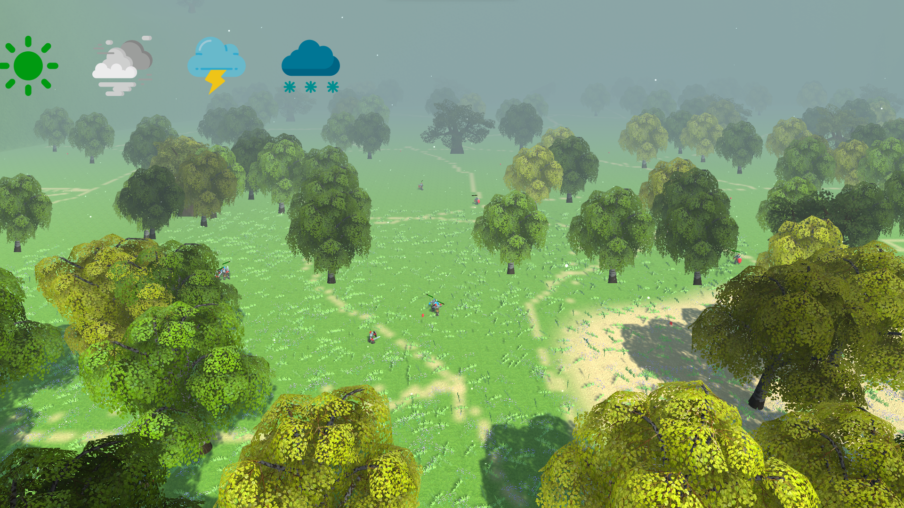
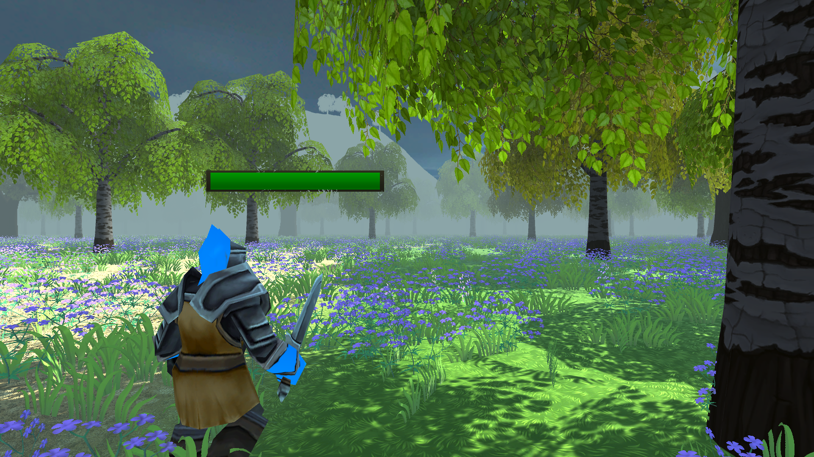

# RPG Simulation (Simulation de bataille entre chevaliers)

Bienvenue dans RPG Simulation, un projet de simulation de bataille entre deux équipes de chevaliers rouges et bleus. Chaque chevalier est doté d'une intelligence artificielle, déterminant s'il est peureux, courageux, et influençant ses décisions lors des combats. L'objectif principal de ce projet est d'observer l'évolution d'une bataille dynamique où les chevaliers prennent des décisions stratégiques en fonction de leur personnalité.

## Présentation du Projet

Les deux équipes de chevaliers se combattent, utilisant l'intelligence artificielle pour simuler des réactions réalistes. Chaque chevalier, en fonction de sa personnalité, peut choisir de différentes options. Les chevaliers se créer des groupes au fil de la partie pour ne pas se retouver se seul.
Nous avons aussi décider d"ajouter de l'aléatoire dans le jeu avec un dragon qui parcours la carte et qui peut attaquer les chevaliers.

## Objectif

L'objectif principal de Simulation de RPG est d'observer comment différentes personnalités de chevaliers influent sur le résultat d'une bataille. En étudiant leurs choix tactiques, leurs décisions d'attaque ou de fuite, nous cherchons à comprendre comment ces caractéristiques individuelles contribuent à l'issue globale de la bataille.

## Comment Build le Projet

### Avec Visual Studio

1. Ouvrez le fichier de solution du projet dans Visual Studio.
2. Configurez les paramètres de build selon vos préférences.
3. Appuyez sur F5 ou sélectionnez "Build" puis "Start Debugging" pour compiler et exécuter le projet.

### Avec Unity

1. Ouvrez Unity et le projet RPG Simulation.
2. Allez dans `File > Build Settings` et sélectionnez la plateforme de votre choix.
3. Une fois la plateforme sélectionnée, cliquez sur `Build and Run` pour compiler et exécuter le projet.

### Contact

LAHCENE Nael Licence 3 Informatique Lyon 1 
Numéro éudiant : 12107990
Adresse mail : nael.lahcene@etu.univ-lyon1.fr

HOFMANN Pierre Licence 3 Informatique Lyon 1 
Numero étudiant : 12108996
Adresse mail : pierre.hofmann@etu.univ-lyon1.fr

NECHADI Mehdi Licence 3 Informatique Lyon 1
Numero étudiant : 12110129
Adresse mail : mehdi.nechadi@etu.univ-lyon1.fr

